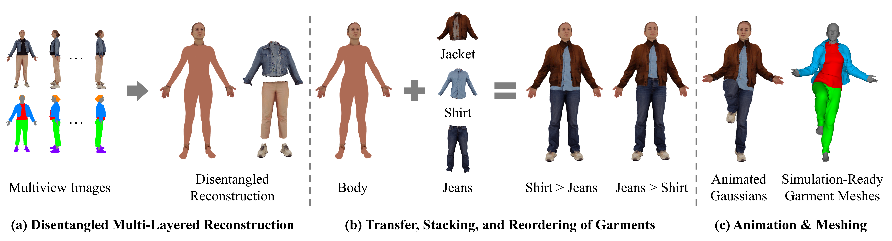
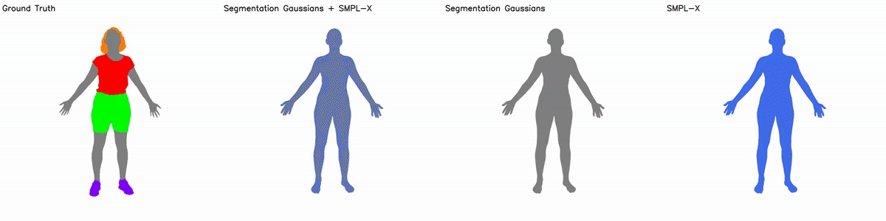
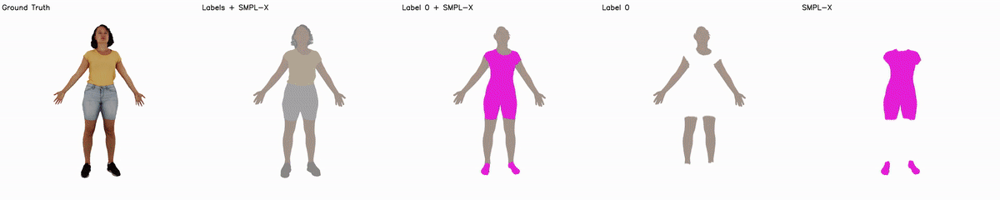
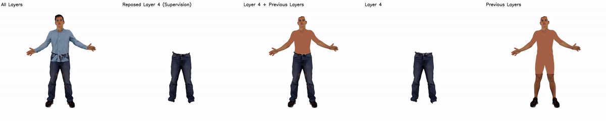
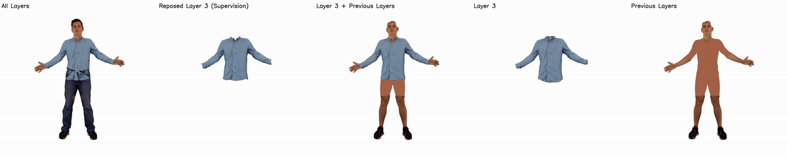
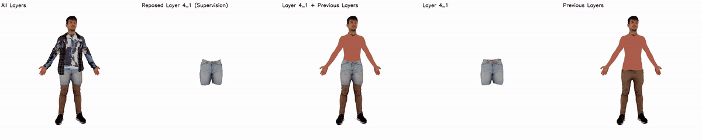
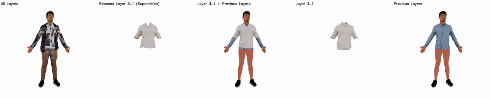
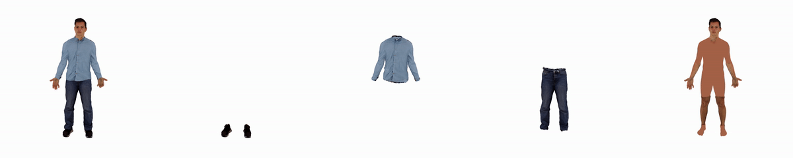

<h1 align="center">
DAMA: Disentangled Body-Anchored Gaussians <br> for Controllable Multi-Layered Avatars
</h1>

<p align="center">
  <a target="_blank" href="https://danieleskandar.github.io/">Daniel Eskandar</a><sup>1,2,5</sup>&emsp;
  <a target="_blank" href="https://bernakabadayi.github.io/">Berna Kabadayi</a><sup>1,3</sup>&emsp;
  <a target="_blank" href="https://garvita-tiwari.github.io/">Garvita Tiwari</a><sup>1,2,4</sup>&emsp;
  <a target="_blank" href="https://virtualhumans.mpi-inf.mpg.de/people/pons-moll.html">Gerard Pons-Moll</a><sup>1,2,4</sup>
</p>

<p align="center"> <sup>1</sup>University of Tübingen &emsp; <sup>2</sup>Tübingen AI Center &emsp; <sup>3</sup>Max Planck Institute for Intelligent Systems <br> <sup>4</sup>Max Planck Institute for Informatics &emsp; <sup>5</sup>Zuse School ELIZA </p>


<p align="center">
  <strong>
    <a target="_blank" href="https://physhuman.github.io/">
      PhysHuman Workshop @ CVPR 2026
    </a>(Oral)
  </strong>
</p>

<p align="center">
  <a target="_blank" href="https://danieleskandar.github.io/dama/">
    
  </a>
  <a target="_blank" href="https://arxiv.org/pdf/2605.21001">
    
  </a>
  <a target="_blank" href="https://arxiv.org/abs/2605.21001">
    
  </a>
  <a target="_blank" href="https://physhuman.github.io/">
    
  </a>
</p>

<p align="center">
  
</p>

## 1. Installation

Tested on an `RTX 2080 Ti GPU (11 GB VRAM)` with `Python 3.9`, `PyTorch 2.7.1`, and `CUDA 11.8`.

See [INSTALL.md](INSTALL.md) for environment setup and installation instructions.

---

## 2. Preprocessing

We use the [4D-DRESS](https://eth-ait.github.io/4d-dress/) dataset.

Set the dataset path and subject ID:

```bash
DATASET_PATH=path/to/4D-DRESS
SUBJECT_ID=00152_Inner
```

Extract SMPL-X model, texture, and semantic labels of the first frame:

```bash
python preprocess/4D-DRESS/extract.py -d $DATASET_PATH -s $SUBJECT_ID
```

<details>
<summary><strong style="font-size: 0.95em;">Output</strong></summary>

* `data/4D-DRESS/$SUBJECT_ID/raw`

</details>

Normalize the scan and SMPL-X meshes and create textured and segmented meshes:

```bash
python preprocess/4D-DRESS/normalize.py -s $SUBJECT_ID
```

<details>
<summary><strong style="font-size: 0.95em;">Output</strong></summary>

* `data/4D-DRESS/$SUBJECT_ID/meshes`

</details>

Render multiview RGB images, segmentation masks, and save camera parameters:

```bash
blender -b -P preprocess/4D-DRESS/render.py -- -s $SUBJECT_ID --render_vis
```

<details>
<summary><strong style="font-size: 0.95em;">Arguments</strong></summary>

* `-s`: subject ID
* `--render_vis`: render 360° visualization views *(optional)*

</details>

<details>
<summary><strong style="font-size: 0.95em;">Output</strong></summary>

* `data/4D-DRESS/$SUBJECT_ID/images`
* `data/4D-DRESS/$SUBJECT_ID/segmentation_masks`
* `data/4D-DRESS/$SUBJECT_ID/transforms_*.json`

</details>

Convert the SMPL-X mesh into Gaussian primitives:

```bash
python preprocess/create_smplx_gaussians.py -d data/4D-DRESS -s $SUBJECT_ID
```

<details>
<summary><strong style="font-size: 0.95em;">Arguments</strong></summary>

* `-d`: dataset directory
* `-s`: subject ID

</details>

<details>
<summary><strong style="font-size: 0.95em;">Output</strong></summary>

* `data/4D-DRESS/$SUBJECT_ID/gaussians/main/posed`

</details>

---

## 3. Training

Train the segmentation Gaussians (Stage 1) and perform topology-aware label refinement (Stage 2):

```bash
python train/train_segmentation.py \
    -s data/4D-DRESS/$SUBJECT_ID \
    -c data/4D-DRESS/label_colors.npy \
    --vis
```

<details>
<summary><strong style="font-size: 0.95em;">Arguments</strong></summary>

* `-s`: subject directory
* `-c`: semantic label color map
* `--vis`: save training visualizations *(optional)*
* `--circular`: render a rotating camera trajectory around the avatar *(optional)*

</details>

<details>
<summary><strong style="font-size: 0.95em;">Output</strong></summary>

* `data/4D-DRESS/$SUBJECT_ID/gaussians/main/posed`
* `data/4D-DRESS/$SUBJECT_ID/gaussians/main/canonical`
* `data/4D-DRESS/$SUBJECT_ID/training/segmentation`

</details>



Train the textured layered avatar representation (Stage 3):

```bash
python train/train_texture.py \
    -s data/4D-DRESS/$SUBJECT_ID \
    -c data/4D-DRESS/label_colors.npy \
    --vis
```

<details>
<summary><strong style="font-size: 0.95em;">Arguments</strong></summary>

* `-s`: subject directory
* `-c`: semantic label color map
* `--vis`: save training visualizations *(optional)*
* `--circular`: render a rotating camera trajectory around the avatar *(optional)*

</details>

<details>
<summary><strong style="font-size: 0.95em;">Output</strong></summary>

* `data/4D-DRESS/$SUBJECT_ID/gaussians/main/posed`
* `data/4D-DRESS/$SUBJECT_ID/gaussians/main/canonical`
* `data/4D-DRESS/$SUBJECT_ID/training/texture`

</details>



---

## 4. Evaluation and Visualization

Render visualization videos for the segmentation, texture, garments, and canonical representations:

```bash
python evaluation/visualize.py -s data/4D-DRESS/$SUBJECT_ID
```

<details>
<summary><strong style="font-size: 0.95em;">Arguments</strong></summary>

* `-s`: subject directory

</details>

<details>
<summary><strong style="font-size: 0.95em;">Output</strong></summary>

* `data/4D-DRESS/$SUBJECT_ID/vis/main/segmentation`
* `data/4D-DRESS/$SUBJECT_ID/vis/main/texture`
* `data/4D-DRESS/$SUBJECT_ID/vis/main/garments`
* `data/4D-DRESS/$SUBJECT_ID/vis/main/canonical`

</details>

Evaluate the reconstructed avatar using image-based and geometry-based metrics:

```bash
python evaluation/metrics.py -s data/4D-DRESS/$SUBJECT_ID
```

<details>
<summary><strong style="font-size: 0.95em;">Arguments</strong></summary>

* `-s`: subject directory

</details>

<details>
<summary><strong style="font-size: 0.95em;">Output</strong></summary>

* Terminal metrics table containing:
  * PSNR
  * LPIPS
  * Chamfer Distance
  * Penetration Rate
  * Penetration Depth

</details>

---

## 5. Applications

Before running applications, preprocessing and training must be completed for all involved subjects.

We follow the 4D-DRESS semantic labels: `0` skin, `1` hair, `2` shoes, `3` upper, `4` lower, and `5` outer.

---

### Retargeting

Transfer garments from source subjects to a target subject while replacing the corresponding garments of the target subject.

```bash
python applications/retarget.py \
    -s data/4D-DRESS/00122_Inner \
    -g3 data/4D-DRESS/00188_Inner \
    -g4 data/4D-DRESS/00176_Inner \
    --vis
```

<details>
<summary><strong style="font-size: 0.95em;">Arguments</strong></summary>

* `-s`: target subject
* `-g1` to `-g5`: source subjects for hair, shoes, upper, lower, and outer garments
* `--layer_order`: garment stacking order from inner to outer *(optional)*
* `--vis`: save optimization visualizations during retargeting *(optional)*
* `--circular`: render a rotating camera trajectory around the avatar *(optional)*

</details>

<details>
<summary><strong style="font-size: 0.95em;">Output</strong></summary>

* `data/4D-DRESS/<subject_id>/gaussians/main/retargeted`
* `data/4D-DRESS/<subject_id>/training/retargeting`

</details>



Changing the layer order changes the garment stacking configuration. The following example places the upper garment (`3`) underneath the lower garment (`4`):

```bash
python applications/retarget.py \
    -s data/4D-DRESS/00122_Inner \
    -g3 data/4D-DRESS/00188_Inner \
    -g4 data/4D-DRESS/00176_Inner \
    --layer_order 2 3 4 5 1 \
    --vis
```



---

### Stacking

Build multi-layered avatars by progressively stacking garments from different subjects while preserving previously existing layers.

```bash
python applications/layer.py \
    -s data/4D-DRESS/00188_Inner \
    -g3 data/4D-DRESS/00122_Inner data/4D-DRESS/00175_Inner_1 \
    -g4 data/4D-DRESS/00152_Inner \
    -g5 data/4D-DRESS/00122_Outer \
    --vis
```

<details>
<summary><strong style="font-size: 0.95em;">Arguments</strong></summary>

* `-s`: target subject
* `-g2` to `-g5`: source subjects for shoes, upper, lower, and outer garments
* `--layer_order`: garment stacking order from inner to outer *(optional)*
* `--vis`: save optimization visualizations during stacking *(optional)*
* `--circular`: render a rotating camera trajectory around the avatar *(optional)*

</details>

<details>
<summary><strong style="font-size: 0.95em;">Output</strong></summary>

* `data/4D-DRESS/<subject_id>/gaussians/main/layered`
* `data/4D-DRESS/<subject_id>/training/layering`

</details>



Changing the layer order changes the garment stacking configuration. The following example places the upper garment (`3`) underneath the lower garment (`4`):

```bash
python applications/layer.py \
    -s data/4D-DRESS/00188_Inner \
    -g3 data/4D-DRESS/00122_Inner data/4D-DRESS/00175_Inner_1 \
    -g4 data/4D-DRESS/00152_Inner \
    -g5 data/4D-DRESS/00122_Outer \
    --layer_order 2 3 4 5 \
    --vis
```



---

### Animation

Download motion sequences from the [AMASS dataset](https://amass.is.tue.mpg.de/).

Set the AMASS dataset path:

```bash
AMASS_PATH=path/to/amass
```

Animate a posed, retargeted, or layered avatar:

```bash
python applications/animate.py \
    -s data/4D-DRESS/00122_Inner \
    -f retargeted \
    -m $AMASS_PATH/DFaust/50026/50026_one_leg_jump_stageii.npz \
    -n one_leg_jump \
    --render_layers \
    --circular
```

<details>
<summary><strong style="font-size: 0.95em;">Arguments</strong></summary>

* `-s`: target subject
* `-f`: avatar version (`posed`, `retargeted`, or `layered`)
* `-m`: path to the AMASS motion sequence
* `-n`: output animation name
* `--render_layers`: render individual clothing layers next to the full avatar *(optional)*
* `--circular`: render a rotating camera trajectory around the avatar *(optional)*
* `--cam_index`: camera index used for rendering when `--circular` is not enabled *(optional)*

</details>

<details>
<summary><strong style="font-size: 0.95em;">Output</strong></summary>

* `data/4D-DRESS/<subject_id>/animation/main/<folder>/<animation_name>`

</details>


---

### Mesh Extraction

Convert Gaussian clothing layers into simulation-ready meshes.

```bash
python applications/meshify.py -s data/4D-DRESS/00122_Inner -f retargeted
```

<details>
<summary><strong style="font-size: 0.95em;">Arguments</strong></summary>

* `-f`: avatar version to convert (`posed` or `retargeted`)
* `--normal_map`: export meshes with normal-based colors instead of appearance colors

</details>

<details>
<summary><strong style="font-size: 0.95em;">Output</strong></summary>

* `data/4D-DRESS/<subject_id>/gaussians/main/<folder>/<garment_id>_mesh.ply`

</details>

## Acknowledgements

This repository is built on top of the [2D Gaussian Splatting](https://github.com/hbb1/2d-gaussian-splatting) repository.

## Citation

```bibtex
@InProceedings{eskandar2026dama,
    author    = {Eskandar, Daniel and Kabadayi, Berna and Tiwari, Garvita and Pons-Moll, Gerard},
    title     = {DAMA: Disentangled Body-Anchored Gaussians for Controllable Multi-Layered Avatars},
    booktitle = {Proceedings of the IEEE/CVF Conference on Computer Vision and Pattern Recognition Workshops (CVPRW)},
    month     = {June},
    year      = {2026},
    pages     = {5799--5811}
}
```